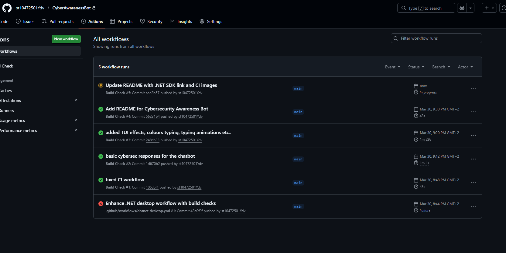

# Cybersecurity Awareness Bot
### PROG6221/w — Programming 2A | Part 3 (POE)
**Student Number:** ST10472501

---

## Description
A comprehensive Cybersecurity Awareness Chatbot built in C# with a WPF GUI. Educates users about cybersecurity threats through conversational interaction, task management, and interactive quizzes.

The project is developed in three parts:
- **Part 1:** Console chatbot with voice greeting, ASCII art, keyword responses
- **Part 2:** WPF GUI chatbot with keyword recognition, random responses, sentiment detection (delegates), conversation flow, and memory recall
- **Part 3 / POE:** Task assistant with MySQL database, cybersecurity quiz mini-game, NLP simulation, and activity log

---

## How to Run

**Requirements**
- Windows PC (WPF requires Windows)
- .NET 10 SDK — https://dotnet.microsoft.com/download/dotnet/10
- MySQL 8.0 Server running (default: root / password set in DatabaseService.cs)

**Steps**

1. Clone the repository:
```
git clone https://github.com/st10472501Ydv/CyberAwarenessBot.git
```

2. Run the GUI application:
```
cd CyberAwarenessBot/CyberAwarenessBot.Gui
dotnet run
```

3. To run the console version (Part 1 only):
```
cd CyberAwarenessBot/CyberAwarenessBot
dotnet run
```

---

## Features (All Parts)

### Part 1 — Console Chatbot
- Voice greeting on startup (WAV format)
- ASCII art logo displayed as header
- Personalised greetings with user's name
- Cybersecurity Q&A (password safety, phishing, safe browsing)
- Input validation and graceful error handling
- Coloured text and typing effects

### Part 2 — WPF GUI Chatbot
- Graphical user interface with dark theme design
- ASCII logo displayed in the GUI header
- Voice greeting on application launch
- 5 keyword categories with multiple random responses each
- "Another tip" and "Tell me more" follow-up handling
- Favourite topic memory with spontaneous recall
- Sentiment detection using **delegate-based response strategies** (worried, curious, frustrated)

### Part 3 / POE — Advanced Features
- **Tabbed Interface:** Chat | Tasks | Quiz | Activity Log
- **Task Assistant:** Add, view, complete, and delete cybersecurity tasks
- **MySQL Database:** Stores tasks with CRUD operations (Add, Read, Update, Delete)
- **Quiz Mini-Game:** 12 cybersecurity questions with multiple-choice/true-false, instant feedback, and score tracking
- **NLP Simulation:** Keyword and regex-based command detection for task/quiz/reminder/log phrases with flexible phrasing
- **Activity Log:** Tracks all key actions (tasks added, quiz attempts, reminders set) with timestamps; shows last 10 with "Show All" option

---

## Project Structure
```
CyberAwarenessBot/
├── CyberAwarenessBot/              # Part 1 - Console app
│   ├── Program.cs
│   └── src/
│       ├── Assets/
│       │   ├── greeting.wav
│       │   ├── ci-screenshot1.png
│       │   └── ci-screenshot2.png
│       ├── Services/
│       │   ├── ChatBot.cs
│       │   └── VoiceGreeting.cs
│       └── UI/
│           ├── AsciiArt.cs
│           └── ConsoleHelper.cs
├── CyberAwarenessBot.Gui/          # Part 2 & 3 - WPF GUI app
│   ├── MainWindow.xaml
│   ├── MainWindow.xaml.cs
│   ├── App.xaml / App.xaml.cs
│   ├── Converters/
│   │   └── BoolToStatusConverter.cs
│   ├── Helpers/
│   │   └── AsciiArt.cs
│   ├── Models/
│   │   ├── ActivityLogEntry.cs
│   │   ├── CyberTask.cs
│   │   └── QuizQuestion.cs
│   └── Services/
│       ├── ActivityLog.cs
│       ├── ChatService.cs
│       ├── DatabaseService.cs
│       ├── QuizGame.cs
│       ├── SentimentAnalyzer.cs
│       └── VoiceGreeting.cs
├── .github/workflows/ci.yml
├── CyberAwarenessBot.slnx
├── README.md
└── .gitignore
```

---

## GitHub Actions CI
The workflow builds the GUI project automatically on every push to check for errors.


**CI Build Screenshot**



---

## Video Presentation
Link: [replace with your YouTube link]

---

## Tags / Releases
- **v1.0.0** — Console chatbot with voice, ASCII art, and basic responses
- **v2.0.0** — WPF GUI with sentiment detection, memory, and conversation flow
- **v2.1.0** — XML documentation and code clarity improvements
- **v3.0.0** — Part 3/POE: Task assistant, MySQL DB, quiz mini-game, NLP simulation, activity log
